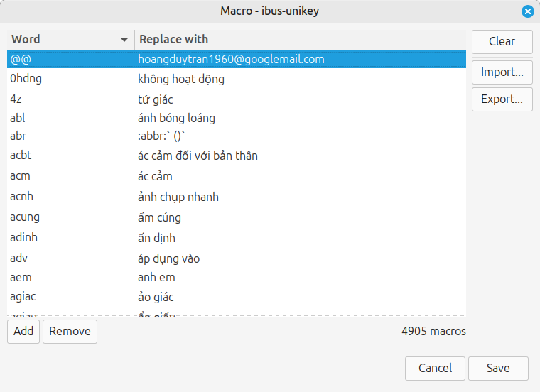

# Thư mục ảnh review macro UI

Thư mục này được tạo sẵn để chứa:
- ảnh chụp macro dialog,
- ảnh file chooser import/export,
- GIF hoặc PNG phục vụ review PR.

## Gợi ý tên file

- `macro-dialog-main.png`
- `macro-dialog-edit-long-text.png`
- `macro-import-chooser-last-dir.png`
- `macro-export-chooser-last-dir.png`

## Ảnh hiện có

- `main-settings-window.png`
- `macro-dialog-main.png`
- `macro-dialog-add.png`
- `macro-dialog-edit.png`
- `macro-chooser-last-working-dir-example-1.png`
- `macro-chooser-last-working-dir-example-2.png`
- `macro-chooser-example-3.png`
- `macro-chooser-example-4.png`

## Cách dùng

Sau khi thêm ảnh vào đây, cập nhật file:
- [review/20260309_macro_feature_review_vi.md](../review/20260309_macro_feature_review_vi.md)

ví dụ:

```md

```

Hiện tại tài liệu review đã đủ để reviewer kiểm thử mà không cần ảnh bắt buộc.
